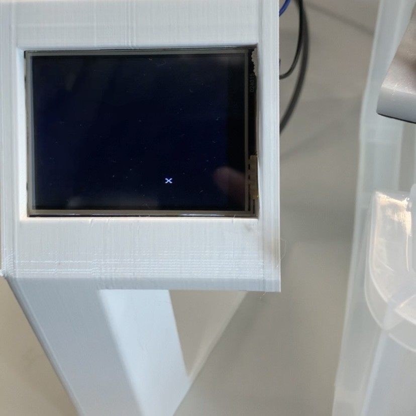

<h1 align="center">Kishan Grewal</h1>

<h3 align="center">
  Robotics & AI @ UCL 
  Arduino · C · ROS 2 · C++ · Python
</h3>

  

## 
Projects

### 
Mini Pupper (ROS 2 Tracking)

  

  Official ROS 2 tracking package contribution for Mini Pupper's Stanford Controller. 
  <a href="https://github.com/mangdangroboticsclub/mini_pupper_ros/tree/ros2-dev/mini_pupper_tracking">View code →</a>

---

### 
Rover Controller (Arduino GIGA R1)

  

  Custom autonomous controller (line following + wall following) with QTR and IR sensors. 
  <a href="https://github.com/kishan-grewal/rover-controller">View code →</a>

---

### 
Dual Arduino Board

  

  Two-board system with 3D-printed controller (IMU + TFT) and WiFi UDP link to rover body with encoders + tilt detection. 
  <i>(Repo coming soon)</i>

