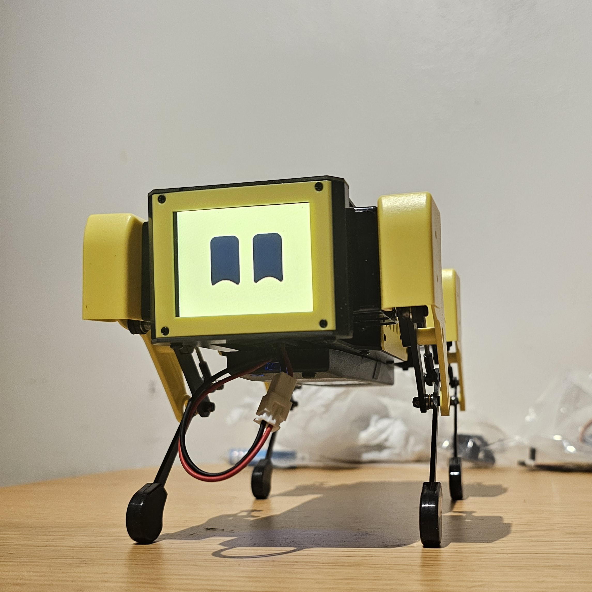
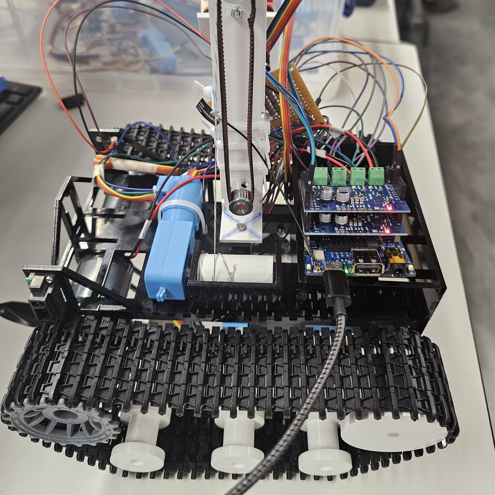

<h1 align="center">Kishan Grewal</h1>

<h3 align="center">
  Robotics Engineering @ UCL 
  ROS 2 · C++ · Python · Real-Time Control & Perception
</h3>

  

---

## 
ROS 2 Systems

  <b>Mini Pupper Tracking</b> – Real-time person-following pipeline in ROS 2 with YOLO detection, IMU sensor fusion, and PID control (±0.10 rad precision at 67 Hz). 
  <a href="https://github.com/mangdangroboticsclub/mini_pupper_ros/tree/ros2-dev/mini_pupper_tracking">Code →</a>

  <b>Mini Pupper Fleet (coming soon)</b> – Distributed multi-robot coordination using namespaced ROS 2 nodes, EKF-based attitude estimation, and SE(3)-aware control.

  

---

## 
Hardware Integration

  <b>Rover Controller</b> – Autonomous rover with dual-mode PID (line & wall following), IR/optical sensor fusion. 
  <a href="https://github.com/kishan-grewal/rover-controller">Code →</a>

  

